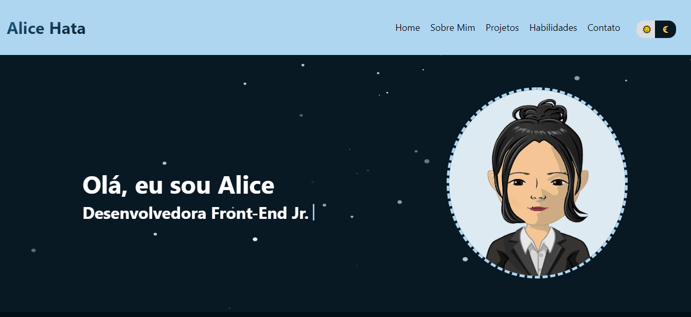

<h1 align="center">
  
</h1>

# Portfolio

Este projeto é um portfólio para apresentar parte de minhas habilidades, qualificações, formação e experiência profissional.

## Tecnologias Utilizadas neste projeto

[React](https://pt-br.reactjs.org/docs/getting-started.html)
[Create React App](https://github.com/facebook/create-react-app).
[Typescript](https://www.typescriptlang.org/docs/handbook/typescript-in-5-minutes.html)
[SASS](https://sass-lang.com/documentation)

Os ícones da aplicação estão disponíveis em: [Icons8](https://icons8.com)
